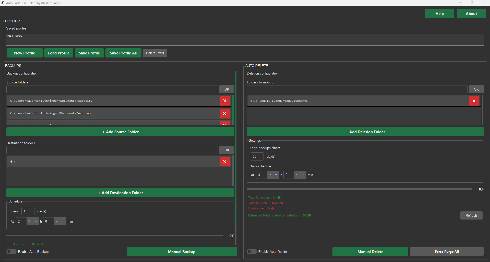

<div align="center">

# Auto Backup & Delete

**Sauvegardez vos dossiers automatiquement. Supprimez les vieilles archives sans effort.**

[](https://www.python.org/)
[](https://docs.python.org/3/library/tkinter.html)
[](https://github.com/valuthringer)
[](https://valuthringer.github.io)
[](LICENSE)

*Application desktop Python avec interface graphique — thème Forest Dark*

</div>

---

## Apercu

**Auto Backup & Delete** est un outil de sauvegarde et de nettoyage automatique de fichiers. Il permet de compresser vos dossiers importants en `.zip` horodatés, de les envoyer vers un ou plusieurs emplacements de destination, et de supprimer automatiquement les archives trop anciennes — le tout via une interface graphique minimaliste.

---

## Fonctionnalités

### Sauvegarde
- **Sauvegarde manuelle** — lancez une sauvegarde immédiate en un clic
- **Sauvegarde automatique planifiée** — configurez une fréquence (tous les N jours) et une heure précise
- **Multi-sources** — ajoutez plusieurs dossiers sources dans une même archive
- **Multi-destinations** — sauvegardez simultanément vers plusieurs emplacements (disque local, NAS, clé USB...)
- **Format de nommage** : `Backup_DD-MM-YYYY_N.zip` avec incrémentation automatique
- **Barre de progression** en temps réel

### Suppression automatique
- **Suppression planifiée** des archives `.zip` plus anciennes que N jours, tous les jours à l'heure configurée
- **Suppression manuelle** à la demande
- **Force Purge** — suppression totale des dossiers surveillés (double confirmation requise)
- **Simulation en temps réel** : taille à supprimer, nombre de fichiers éligibles, taille estimée après nettoyage

### Informations disque (temps réel)
- Taille totale des dossiers sources
- Espace disponible sur la destination
- Estimation de l'espace restant après sauvegarde (avec alerte si insuffisant)
- Prochaine sauvegarde programmée

### Profils de configuration
- Sauvegardez et rechargez des configurations complètes (sources, destinations, planning, paramètres de suppression)
- **Auto-save** du profil actif toutes les 5 minutes
- Profils stockés dans `%APPDATA%\Auto-Backup-and-Delete\profiles.json`

---

## Interface



---

## Installation

### Prérequis

- Python 3.8 ou supérieur
- pip

### Depuis les sources

```bash
git clone https://github.com/valuthringer/Auto-Backup-and-Delete.git
cd Auto-Backup-and-Delete
pip install schedule
python autobackup.py
```

### Depuis l'executable (.exe)

Téléchargez le dernier `.exe` depuis les [Releases](https://github.com/valuthringer/Auto-Backup-and-Delete/releases) et lancez-le directement — aucune installation Python requise.

Pour recompiler l'executable vous-meme :

```bash
pip install pyinstaller
pyinstaller autobackup.spec
```

---

## Guide d'utilisation

### Sauvegarde

1. Cliquez sur **+ Add Source Folder** pour ajouter les dossiers a sauvegarder
2. Cliquez sur **+ Add Destination Folder** pour choisir la ou les destinations
3. Configurez la frequence (tous les N jours) et l'heure dans la section **Schedule**
4. Activez **Enable Auto-Backup** pour les sauvegardes automatiques, ou cliquez **Manual Backup** pour une sauvegarde immediate

> Les sauvegardes sont des fichiers `.zip` nommes `Backup_DD-MM-YYYY_N.zip`.  
> Si plusieurs destinations sont configurees, le fichier est copie dans chacune simultanement.

### Suppression

1. Cliquez sur **+ Add Deletion Folder** pour surveiller un ou plusieurs dossiers
2. Definissez le nombre de jours de retention dans **Keep backups since**
3. Configurez l'heure de nettoyage quotidien dans **Daily schedule**
4. Activez **Enable Auto-Delete** ou cliquez **Manual Delete** pour lancer le nettoyage

> Seuls les fichiers `.zip` sont supprimes lors des suppressions planifiees/manuelles.  
> **Force Purge All** supprime l'ensemble du contenu des dossiers surveilles (double confirmation).

### Profils

| Action | Description |
|---|---|
| **New Profile** | Remet tous les champs a zero |
| **Save Profile As** | Sauvegarde la configuration sous un nouveau nom |
| **Save Profile** | Met a jour le profil actif |
| **Load Profile** | Charge le profil selectionne dans la liste |
| **Delete Profile** | Supprime definitivement le profil selectionne |

Le profil actif est **auto-sauvegarde toutes les 5 minutes** en arriere-plan.

---

## Stack technique

| Composant | Detail |
|---|---|
| Langage | Python 3.8+ |
| Interface graphique | Tkinter + ttk |
| Theme UI | [Forest-ttk-theme](https://github.com/rdbende/Forest-ttk-theme) (dark) |
| Compression | `zipfile` (ZIP_DEFLATED) |
| Planification | `schedule` |
| Threading | `threading` (operations non-bloquantes) |
| Persistance | JSON (`%APPDATA%\Auto-Backup-and-Delete\profiles.json`) |
| Build | PyInstaller |

---

## Auteur

Developpe par **Valentin Luthringer** — [@valuthringer](https://valuthringer.github.io)

Version **3.1** — Mai 2026
